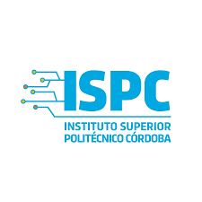

# Repositorio para almacenamiento de TPs

### Carrera Tecnico Superior en Telecomunicaciones

#### Materia: Electronica Microcontrolada
*  DOCENTE: Cristian Gonzalo Vera
*  Nombre del Alumno: Jose Augusto Orsili             

### AÑO: 2023
>>>>>>> 8fc9cb8844ec3b0d2d59ad2a8f6e804e52a9a9f7
