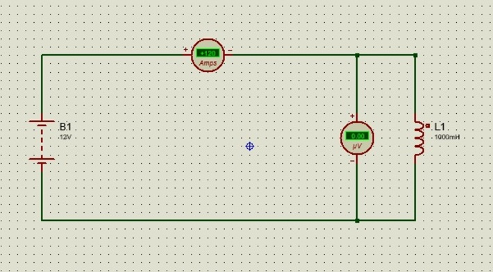

#### TP #3 Simulación Electrónica

##### Objetivos

* Comprender los fundamentos eléctricos y electrónicos básicos en circuitos.
* Aprender a diseñar y simular circuitos eléctricos y electrónicos.
* Familiarizarse con los componentes eléctricos y electrónicos, y su función en los circuitos.
* Analizar y comprender los resultados de las simulaciones. Fundamentos eléctricos

1. Diseñar y simular un circuito eléctrico básico con una fuente de tensión, resistencia y un LED.
    Se decidió utilizar una fuente de 12 voltios.
    Para calcular el valor de la resistencia necesaria para conectar un diodo LED a la fuente de 12 voltios se utiliza la ley de Ohm:

    R = (V - V_led) / I_led 

    Donde:

    R es el valor de la resistencia en ohmios
    V es la tensión de la fuente en voltios (en este caso, 12V)
    V_led es la caída de tensión del LED en voltios (normalmente especificado en las características del LED)
    I_led es la corriente recomendada del LED en amperios (también especificado en las características del LED)
    Por ejemplo, si se usa un LED con una caída de tensión de 2V y una corriente recomendada de 20 mA (0.02A), la resistencia necesaria sería:

    R = (12V - 2V) / 0.02A = 500 ohmios

    El valor standarizado obtenible en el mercado es de 470 Ohmios por lo tanto se realizó el proyecto utilizando ese valor que es el más cercano al arrojado por la fórmula.

    [)](assets/EJ1.jpg)

2. Diseñar y simular un circuito eléctrico con un capacitor y analizar el comportamiento de la corriente y la tensión en el capacitor.

    Se utilizo un capacitor electrolitico de 1 microfaradio y una fuente de corriente continua de 5 voltios. Se agrego un amperimetro y un voltimetro para realizar el analisis de la tension y corriente. Mediante un pulsador se realizo la activacion de la conexion entre la fuente y el capacitor.

    [)](assets/EJ2.jpg)

    Al momento de presionar el pulsador pudo observarse un consumo de .02 microamperes y una tension de 5 voltios en el capacitor que fueron bajando cuando se desconecto de la bateria al soltar el pulsador.

    3. Diseñar y simular un circuito eléctrico con un inductor y analizar el comportamiento de la corriente y la tensión en el inductor.

    Se realizo un circuito con un inductor de 1000 Microhenrios conectado a una bateria de 12 voltios y 120 amperes, se coloco un amperimetro y un voltimetro para analizar la corriente y la tension respectivamente.

    [)](assets/EJ3.jpg)

    En un circuito con un inductor de 1000 microhenries conectado a una batería de 12 voltios y 120 amperes de corriente continua, la corriente en el inductor no será de 120 amperes inmediatamente después de conectar la batería, ya que un inductor se opone al cambio brusco en la corriente. En su lugar, la corriente en el inductor aumentará gradualmente, lo que generará una caída de voltaje en el inductor. Esta caída de voltaje se opone al cambio en la corriente, de acuerdo con la ley de Faraday, que establece que la tensión inducida en un inductor es proporcional al cambio de la corriente en el tiempo. Por lo tanto, inicialmente la corriente en el inductor será cero y la tensión en el inductor será de 12 voltios, ya que todo el voltaje de la batería estará en el inductor. Luego, la corriente en el inductor aumentará gradualmente a medida que se cargue el campo magnético en el inductor, lo que generará una caída de voltaje proporcional a la tasa de cambio de la corriente.
    La ecuación que describe el comportamiento de la corriente en un inductor es:

    V = L * dI/dt

    Donde:
    V = tensión en el inductor
    L = valor del inductor en henrios
    dI/dt = tasa de cambio de la corriente en amperes por segundo

    Al resolver esta ecuación diferencial para una fuente de tensión constante, se obtiene que la corriente en el inductor aumenta exponencialmente con el tiempo, según la siguiente fórmula:

    I = (V/R) * (1 - e^(-R*t/L))

    Donde:
    I = corriente en el inductor en amperios
    V = tensión en el inductor en voltios (en este caso, 12 voltios)
    R = resistencia en ohmios (en este caso, se asume que la resistencia es cero)
    t = tiempo en segundos
    L = valor del inductor en henrios (en este caso, 1000 microhenrios o 0.001 henrios)

    Por lo tanto, la corriente en el inductor aumentará gradualmente hasta que alcance un valor estable de 120 amperios. La tasa de cambio de la corriente en el inductor disminuirá a medida que la corriente se aproxime al valor estable, lo que resultará en una caída de voltaje menor en el inductor.

4. Diseñar y simular un circuito eléctrico con un transformador y analizar el comportamiento de la corriente y la tensión en el transformador.

    Se diseño un circuito con un transformador que posee un factor de acoplamiento de 1.0, la entrada de corriente alterna es de 100 Voltios y 50 Hertz.

    [)](assets/EJ4.jpg)

    La tensión RMS (valor eficaz) en el primario y el secundario de un transformador con un factor de acoplamiento de 1.0 y una tensión alterna de entrada de 100 voltios y 50 Hz será la misma, ya que la relación de voltaje es de 1:1.
    La fórmula para calcular la tensión RMS es:

    V_rms = V_peak / sqrt(2)

    Donde V_peak es el valor pico de la tensión. En este caso, la tensión RMS en el primario y el secundario será:

    V_rms = 100 V_peak / sqrt(2) ≈ 70.71 V_rms

    Por lo tanto, tanto la tensión RMS en el primario como en el secundario del transformador será de aproximadamente 70.71 voltios RMS.

    Como podemos observar en la practica la tension efectiva que se midio fue de 70.7 Voltios.

5. Diseñar y simular un circuito eléctrico complejo que involucre fuentes de tensión y corriente, resistencias, capacitores e inductores, y analizar su
comportamiento.

    Se realizo un circuito que involucro los siguientes componentes: 1 Fuente de 24 voltios de corriente continua. 1 resistencia de 1k Ohm, 1 capacitor electrolitico de 100 microfaradios, 1 inductor de 1 microhenry, 1 capacitor electrolitico de 1 microfaradio y una resistencia de 1k utilizada como carga. Los resultados de la simulacion pueden verse en la imagen.

    [)](assets/EJ5.jpg)

##### Fundamentos electrónicos
1. Diseñar y simular un circuito con un diodo rectificador y analizar su comportamiento.
2. Diseñar y simular un circuito con un transistor bipolar como amplificador y analizar su comportamiento.
3. Diseñar y simular un circuito con un transistor bipolar como interruptor y analizar su comportamiento.
4. Diseñar y simular un circuito con un amplificador operacional como sumador inversor y analizar su comportamiento.
5. Diseñar y simular un circuito con un amplificador operacional como comparador y analizar su comportamiento.

Cada actividad deberá estar documentada con un informe que incluya el diseño del circuito, la simulación en Proteus, los cálculos teóricos correspondientes, la
comparación entre los valores teóricos y los resultados de la simulación, y las conclusiones obtenidas.