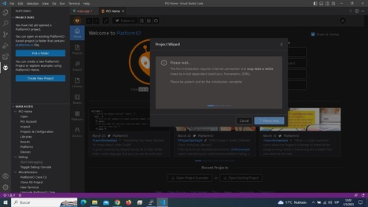
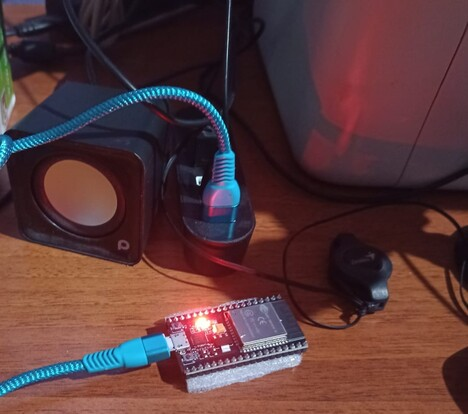
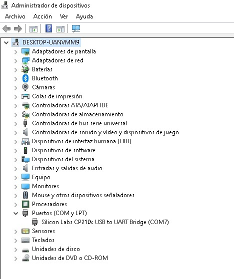

#### Trabajo Practico #4: Platformio y VsCode

#### "Desarrollo de un sistema de monitoreo y control de temperatura utilizando ESP32, PlatformIO y VSCode"

##### Objetivos:

1. Familiarizarse con el entorno de programación de PlatformIO y VSCode para el ESP32.
2. Utilizar los pines analógicos del ESP32 para leer señales de temperatura de un sensor.
3. Implementar un control de temperatura utilizando el ESP32. 
4. Integrar la comunicación WiFi del ESP32 con una aplicación móvil para monitorear y controlar la temperatura a través de Internet.

##### Desarrollo del trabajo práctico:

1. Configuración del entorno de programación: Descargar e instalar las herramientas necesarias, incluyendo VSCode, PlatformIO y la biblioteca de
Arduino para ESP32. Configurar la conexión del ESP32 con la computadora.

    Se Instalo Visual Studio Code y se le configuro PlatformIO que permite la programacion del ESP32 en el IDE mencionado.

   [)](assets/PlatformIO_1.jpg)

    La conexion a la computadora se realizo mediante un cable usb a micro_usb, el mismo provee alimentacion al modulo ESP32 como tambien la transmision de los datos para programarlo.

   [)](assets/ESP32_B.jpeg)

   En la imagen se puede observar el administrador de dispositivos de Windows detectando el ESP32 en el puerto COM7.

   [)](assets/ESP32_A.jpg)

2. Conexión del sensor de temperatura: Conectar el sensor de temperatura al ESP32 utilizando un pin analógico. Implementar un programa que lea la
señal del sensor y la muestre en el monitor serial.
3. Implementación del control de temperatura: Implementar un programa que
lea la señal del sensor de temperatura y encienda o apague un led cuando la temperatura este dentro del rango.
4. Integración con una aplicación móvil: Utilizar la biblioteca WiFi del ESP32 para conectarse a una red WiFi y comunicarse con un dashboard.
5. Presentación de resultados: Realizar una presentación del trabajo práctico y demostrar el sistema de monitoreo y control de temperatura desarrollado
utilizando ESP32, PlatformIO y VSCode.

##### Recursos adicionales:

* Documentación oficial de PlatformIO y VSCode para ESP32.
* Biblioteca de Arduino para ESP32.
#### Tutorial de control de temperatura con ESP32 y sensor de temperatura: 

#### Tutorial de comunicación WiFi con ESP32: 